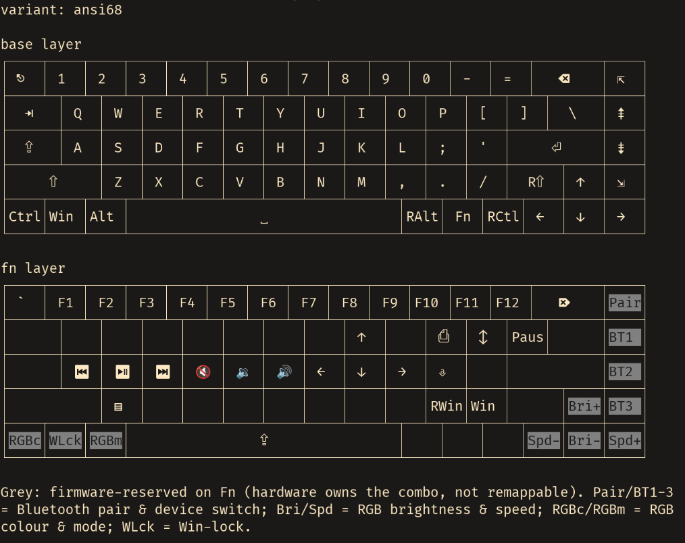
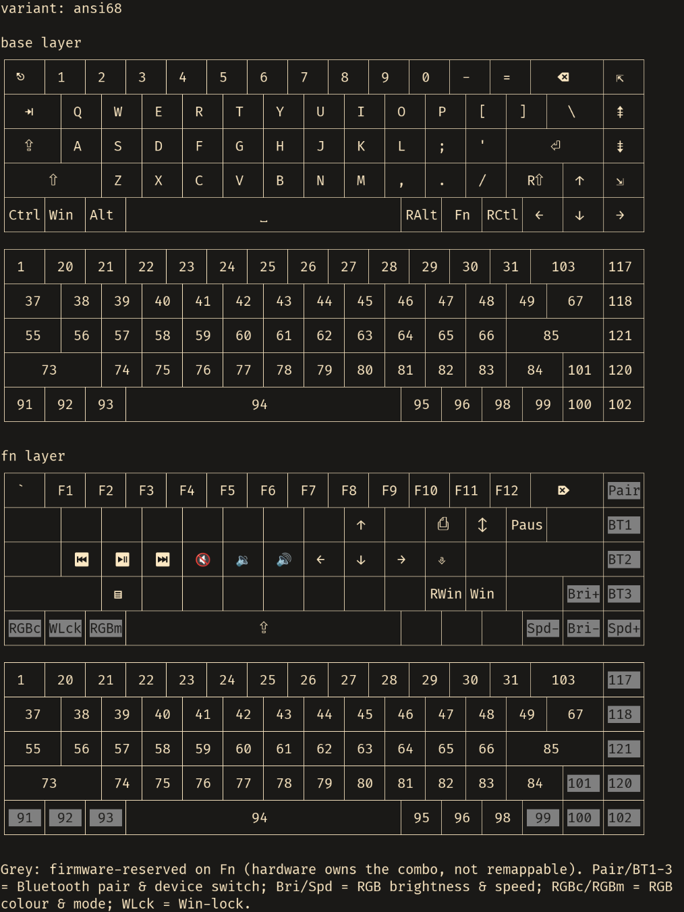
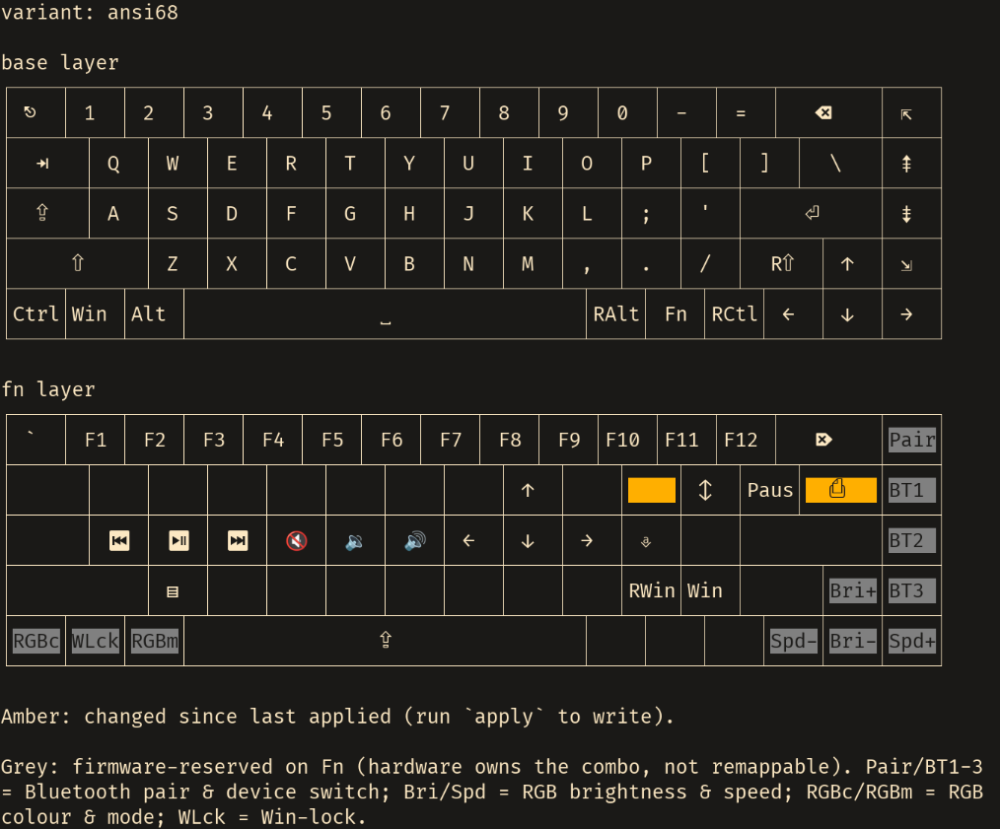

# vtk6800

A native Linux configuration tool for the **Vortex \*66 & \*68 (VTK-6800)**
Family of mechanical keyboards:

| Model | Layout | Tested | Notes |
| ----- | ------ | ------ | ----- |
| KBt RE: 66 | ANSI | ❌️  | Implemented |
| KBt RE: 66 | ISO  | ❌️  | Unreleased (?) |
| KBt RE: 68 | ANSI | ✅️  | Well Tested |
| KBt RE: 68 | ISO  | ❌️  | Unreleased (?) |
| PC66       | ANSI | ❌️  | Implemented |
| PC66       | ISO  | ❌️  | Implemented |
| PC68       | ANSI | ❌️  | Implemented |
| PC68       | ISO  | ❌️  | Implemented |

This family of keybaords is *not* VIA/QMK compatible and only ships a Windows
GUI for configuration. **This tool aims to close the gap for \*nix OS's.**

    PC66/PC68 QMK version is untested.
    Just use the [QMK Configurator](https://config.qmk.fm)

**RGB Programming is not currently supported.**

## DISCLAIMER

This software comes with **no warranty**, and has **not** been extensively
tested on all hardware it is expected to support.

Including on boards that *have* been tested, 
**there is no guarantee it will work, nor any guarantee it will not harm the
hardward.** 

While we expect failures to be safe, we cannot make any guarantees.

**USE AT YOUR OWN RISK**

## Install

Every [release](https://github.com/CRThaze/vtk6800/releases) ships pre-built,
**statically linked** binaries and packages. They depend on no system libraries
(static musl), so the same build runs on any Linux distribution regardless of
its libc version.

Pick the file matching your CPU:

| Machine | `.deb` | `.rpm` | Raw binary |
| ------- | ------ | ------ | ---------- |
| 64-bit x86 (most PCs) | `*_amd64.deb` | `*.x86_64.rpm` | `*-x86_64-linux-musl` |
| 32-bit x86 | `*_i386.deb` | `*.i386.rpm` | `*-i686-linux-musl` |
| 64-bit ARM (Raspberry Pi 4/5, ARM boards) | `*_arm64.deb` | `*.aarch64.rpm` | `*-aarch64-linux-musl` |
| 32-bit ARM (older Pi) | `*_armhf.deb` | `*.armv7hl.rpm` | `*-armv7-linux-musl` |

### Debian / Ubuntu (`.deb`)

```bash
sudo apt install ./vtk6800_<version>_amd64.deb
```

### Fedora / RHEL / openSUSE (`.rpm`)

```bash
sudo dnf install ./vtk6800-<version>-1.x86_64.rpm
```

The packages install `vtk6800` to `/usr/bin`, drop in the udev rule that grants
your user access to the keyboard, and reload udev, so no further setup is needed.

### Raw binary (any distro)

```bash
curl -LO https://github.com/CRThaze/vtk6800/releases/download/v<version>/vtk6800-<version>-x86_64-linux-musl
chmod +x vtk6800-<version>-x86_64-linux-musl
sudo install -m755 vtk6800-<version>-x86_64-linux-musl /usr/local/bin/vtk6800
```

The raw binary does **not** install the udev rule; grant access once with
`sudo vtk6800 udev install` (see [Access](#access-linux)).

### From source

With a [Rust toolchain](https://rustup.rs):

```bash
cargo install --git https://github.com/CRThaze/vtk6800 --locked vtk6800-cli
```

Or from a clone, via the Makefile (installs to `~/.local/bin`):

```bash
git clone https://github.com/CRThaze/vtk6800
cd vtk6800
make install
sudo vtk6800 udev install
```

Source installs, like the raw binary, need the udev rule installed once (above).

## Usage

```bash
$ vtk6800
Command-line frontend for configuring the Vortex VTK-6800 keyboard

Usage: vtk6800 [OPTIONS] <COMMAND>

Commands:
  devices     List connected keyboard HID interfaces
  udev        Manage the Linux udev rule that grants access to the keyboard
  conn-check  Verify the keyboard is connected and responding. Read-only
  default     Show or set the default board variant (used when --variant is omitted)
  keymap      Manage the local keymap (show, set keys, import, diff, apply)
  help        Print this message or the help of the given subcommand(s)

Options:
      --variant <VARIANT>  Board variant (ansi68, iso68, ansi66, iso66). Defaults to the saved default variant (see the `default` command), or ansi68
      --config <CONFIG>    Path to the config file (defaults to the platform config dir)
  -v, --verbose...         Increase verbosity (-v, -vv)
  -h, --help               Print help
  -V, --version            Print version

$ vtk6800 keymap
Manage the local keymap (show, set keys, import, diff, apply)

Usage: vtk6800 keymap [OPTIONS] <COMMAND>

Commands:
  path           Print the keymap file path
  show           Show the current keymap
  set            Stage a key assignment on a layer. Only edits the local keymap (the source of truth); run `apply` to write to the keyboard; `diff` reviews changes
  reset          Reset the keymap to the variant's factory default
  set-fn-mode    Set how the Fn key behaves: `momentary` (hold, factory default) or `latch` (tap to latch the Fn layer on/off)
  save-preset    Save the current keymap as a named preset (per variant)
  load-preset    Load a named preset, overwriting the current keymap
  list-presets   List the saved presets for the variant
  delete-preset  Delete a named preset (asks first)
  import         Import a vendor GUI profile export (.xml) into the local keymap
  diff           Show pending changes vs the last applied snapshot
  apply          Flash the config to the keyboard. Checks connectivity, then asks before writing (unless --commit/--yes)
  help           Print this message or the help of the given subcommand(s)

Options:
      --variant <VARIANT>  Board variant (ansi68, iso68, ansi66, iso66). Defaults to the saved default variant (see the `default` command), or ansi68
      --config <CONFIG>    Path to the config file (defaults to the platform config dir)
  -v, --verbose...         Increase verbosity (-v, -vv)
  -h, --help               Print help
```

### Access (Linux)

The CLI support verifying if your user already has access to the keyboard's
HID nodes (required to write configuration changes to the device).

```bash
$ vtk6800 udev check
# ...
Device access (read/write):
  ok    /dev/hidraw6
  ok    /dev/hidraw6
  ok    /dev/hidraw6
  ok    /dev/hidraw6
  ok    /dev/hidraw6
  ok    /dev/hidraw6
  ok    /dev/hidraw5

$ sudo vtk6800 udev install
```

#### Manual

Grant your user access to the keyboard's HID nodes:

```
# /etc/udev/rules.d/70-vortex-pc68.rules
KERNEL=="hidraw*", ATTRS{idVendor}=="05ac", ATTRS{idProduct}=="0256", MODE="0660", TAG+="uaccess"
```

Then `sudo udevadm control --reload-rules && sudo udevadm trigger`.

### View Keymap

To view the current keymap (on disk only, as we cannot read from the hardware)
or in other words, what would be set if you applied the keymap, you can run:


`vtk6800 keymap show`:



### Modify Keymap

To change the keymap you can use the `vtk6800 keymap set <LAYER> <KEY> <ACTION>` command.
Here it's generally easiest to use the hardware `slot` number for the key you want to modify.

You can see the slots that correspond to the currently layout with the `--slots` flag.

`vtk6800 keymap show --slots`



Then if I were to execute the following remaps:

```bash
$ vtk6800 keymap set fn slot:67 print
$ vtk6800 keymap set fn slot:47 none
```

When I then run `vtk6800 keymap show` I would see:



### Apply

To apply the local keymap along with any changes you've made, run:

```bash
$ vtk6800 keymap apply --commit
```

## Design

### Write-Only

The keyboard firmware exposes **no keymap read-back** (only a live lighting
dump; regardless if the board has RGB lighting), so the local config file is 
the source of truth.

### Layout

| crate | purpose |
|-------|---------|
| `vtk6800-core` | HID transport, protocol, keymap model, per-variant layouts (hardware-independent, unit-tested) |
| `vtk6800-cli`  | Command-line frontend (`clap`) |
| `vtk6800-config` | Configuration file management |
